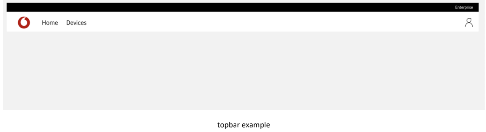
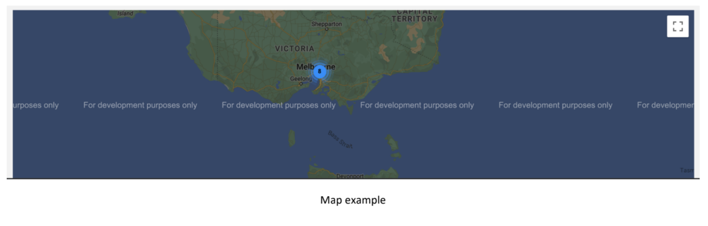

# IoT Vodafone App

We are creating an IoT app where we want to show different devices of a building and we have the requirements to add, delete, or see the details of these devices.

We need to create an application in `React` with `Typescript` and a Backend with `Node`.





## UI requirements:

- App should have a `topbar` menu with the pages links (Home, Devices). [X]
- All pages should contain a basic `title`. [X]
- Home should contain a map with all `devices` location. [X]

## C2 General

- You can click a map `marker` to see device details page. [X]
- Devices page should contain a table showing the different `devices` from the BE. [X]
- Devices page should contain a button to create a new `device`. [X]
- You can click a `device` row to see device details page. [X]

## Data requirements:

- App should have at least 10 different `devices`. [X]
- Device should contain at least ID, name, mobile number, last connection, latitude, and longitude. [X]

## Bonus point

- Use CRA (Create React App). [ ]
- Use NestJS as BE. [ ]
- Use GraphQL. [ ]
- At least test one component with React Testing Library. [ ]
- Show nearest devices grouped in a cluster. [X]

## Technologies Used

- Next.js
- React
- TypeScript
- Tailwind
- Leaflet
- Vercel
- MongoDB Atlas
- Toldo

### Getting Started

To install all required dependencies, run the following command:

```bash
yarn
```

Start the local development server with:

```bash
yarn dev
```

The application will be accessible at http://localhost:3000.

## Deploy to production

To deploy the application to production, simply push your changes to the `main` branch. `Vercel` will automatically handle the build process and deploy the latest version to the `production` environment seamlessly.
